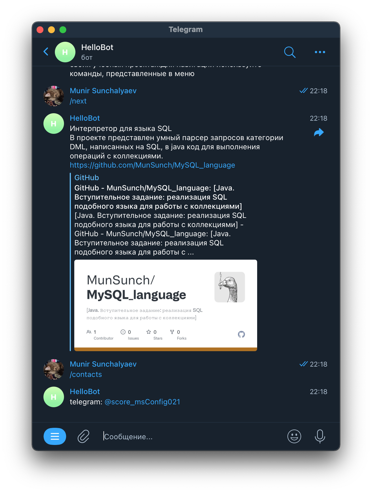

# Телеграм-бот для представления портфолио
Ссылка: [@MunSunBot](https://web.telegram.org/k/#@MunSunBot)

## Описание
Телеграмм бот для представления проектов из [портфолио](https://github.com/MunSunch/Portfolio)

Используемые технологии: Java17, Maven, TelegramBot API, Docker

## Регистрация бота
Для создания бота необходим токен, который необходим серверу телеграмма. Его можно лишь получить
у бота [@BotFather](https://web.telegram.org/k/#@BotFather):

Также регистрируем меню с командами:

## Развертывание
Бот развернут на Raspberry Pi 4 при помощи ssh:

## Примеры запуска
Подключение к боту:

Проверка работы меню с командами:

Узнать контакты:
